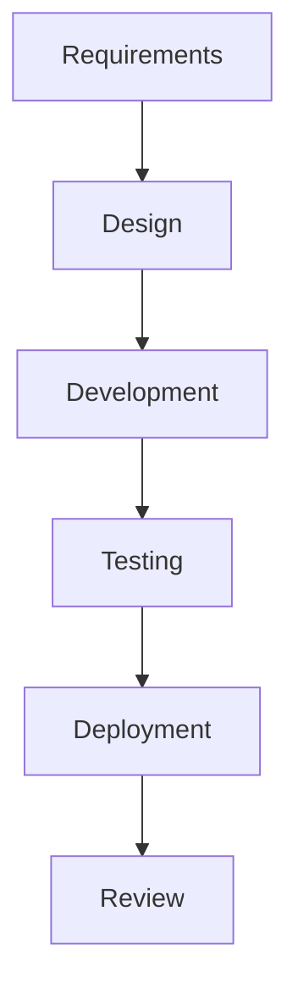
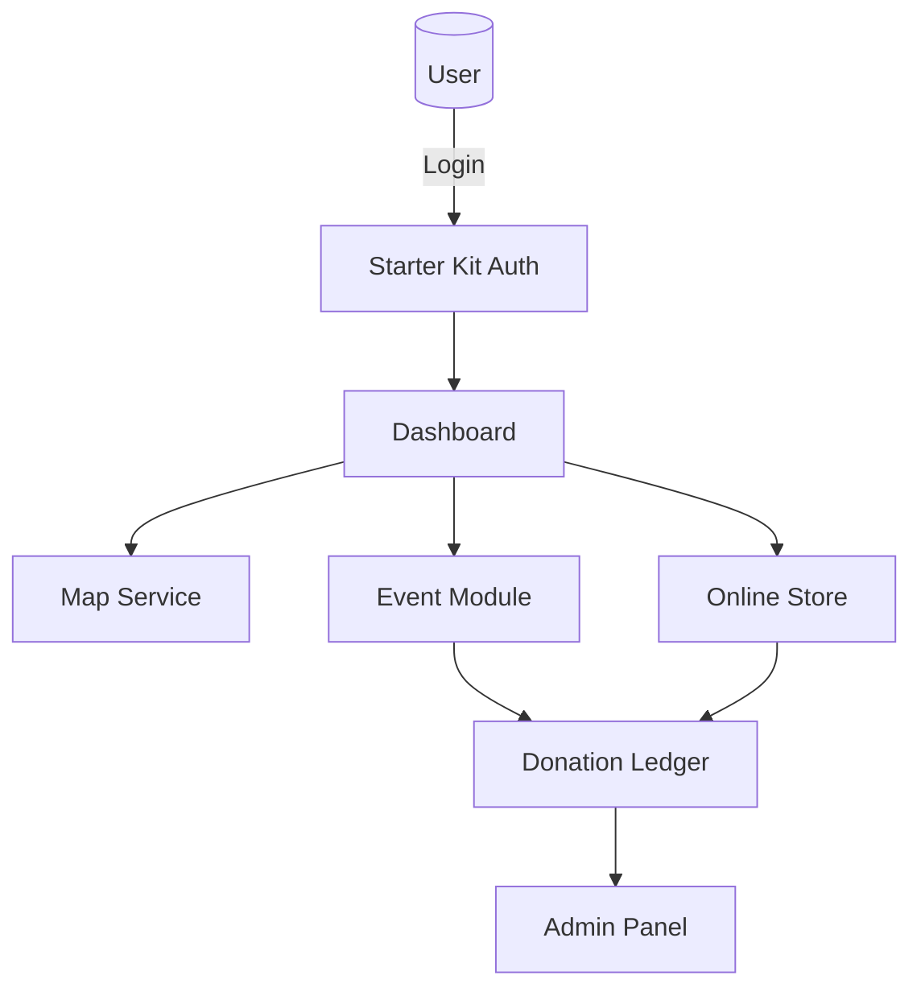
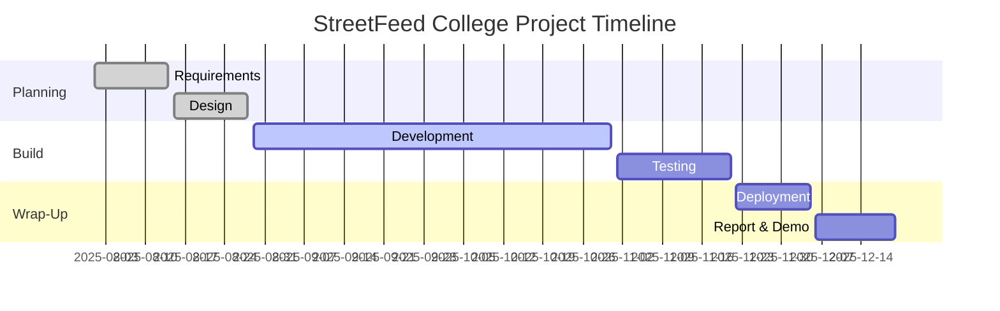

# Proposal Defence Report – StreetFeed: A College Project for Street Animals in Nepal

---

## 1.1 Introduction
Stray dogs are common on the streets of Kathmandu and other Nepali cities. Many of them suffer from hunger, disease and road accidents. **StreetFeed** is a web system that helps volunteers, donors and city staff work together to feed, treat and watch over these animals. The system shows feeding spots on a map, keeps donation records open to the public and sells pet items to raise extra funds.

## 1.2 Problem Statement
Kathmandu Metropolitan City counted about **22 000** stray dogs in 2024 [2]. Current help efforts rely on social media posts and paper notes, so work is doubled or missed. Donors do not always know where their money goes, and the city has little data for planning vaccinations or neutering drives.

## 1.3 Objectives
1. Give one website where volunteers can plan, join and view feeding events.
2. Keep a live, public ledger of all donations for full trust.
3. Show feeding spots and dog-care events on an interactive map.
4. Run a small online store to support the project’s costs.
5. Offer simple reports and open data for city offices and students.

---

## 2.1 Background Study  
A 2022 survey by Humane Society International found **22 000** free-roaming dogs in Kathmandu’s 32 wards. Stray dogs are the main source of rabies in Nepal; the Health Ministry still records **35–40** human deaths a year [1]. Feeding teams and NGOs do good work but use different tools, so their data is scattered. At the same time, digital use is high: Nepal’s mobile broadband user base passed **38 million** in 2023, and QR payments grew by **45 %** year on year [6]. This means an online tool can reach many volunteers and donors at low cost.

## 2.2 Literature Review  
• **Zero by 30** (WHO, 2018) sets a goal to end dog-mediated rabies deaths by 2030 [1].  
• **Dhakal et al.** (2023) found a high level of zoonotic pathogens in Kathmandu’s stray dogs [3].  
• **Poudel et al.** (2024) linked city air pollution to lung problems in stray dogs [4].  
• **O’Haire et al.** (2024) showed how map models can predict dog hotspots, helping target care [5].  
• **Nepal Rastra Bank** (2023) reported a sharp rise in QR donations, proving that digital giving works [6].  
• **UN Volunteers** (2019) highlighted how online platforms boost community projects [7].  
These studies back the idea that one mapped, transparent web system can improve dog care and public health.

---

## 3.1 Functional Requirements
The functional requirements define the core features and capabilities of StreetFeed. Users can sign up through the **Laravel 12 React Starter Kit**, see and add feeding spots on a map, plan or join dog-care events, and donate with bank cards or local wallets. Every donation shows in a public list, a small store sells pet items to raise money, and volunteers earn badges for their help. Admins manage users, events and products, and short reports help city staff plan future work. The system also sends email or push alerts so everyone stays informed.

### Use Case Diagram
```mermaid
usecaseDiagram
  actor Volunteer
  actor Donor
  actor Admin
  actor Guest
  Volunteer --> (Join Event)
  Volunteer --> (Add Feeding Spot)
  Donor --> (Make Donation)
  Admin --> (Manage Users)
  Admin --> (Approve Event)
  Guest --> (Browse Map)
```
*Figure 1 – Main user roles and actions in StreetFeed.*

## 3.2 Non-Functional Requirements
1. **Usability** – Clear buttons and labels; layout tested on laptops and common phones.  
2. **Performance** – Pages load in under 2 s on college Wi-Fi; map markers refresh in <1 s.  
3. **Scalability** – Starts on one low-cost VPS; can copy to a second server if traffic grows.  
4. **Security** – Starter Kit gives login, password reset and CSRF checks; site runs on HTTPS with a free SSL.  
5. **Maintainability** – Code on GitHub with comments and a README for setup; simple branch workflow.  
6. **Reliability** – Daily database export to Google Drive; VPS auto-restarts service after a crash.

---

## 3.3 Feasibility Study
A feasibility study examines whether StreetFeed can be built, launched, and sustained with the limited time, skills, and budget of a college team. It covers three lenses—technical, operational, and economic—and presents risks with mitigation steps.

### 3.3.1 Technical Feasibility
The project builds on the official **Laravel 12 React Starter Kit**, which bundles Laravel, React 19, Vite, TypeScript, Tailwind CSS, and ready-made authentication screens. Because the kit is maintained by the Laravel core team, security patches and documentation are available for at least five years. Development can start on a mid-range laptop (8 GB RAM) using Docker Compose or Laravel Sail, ensuring every contributor shares the same environment.

Core dependencies are all open source:
• **Backend** – Laravel 12 (MIT license) with MySQL 8 community edition.
• **Frontend** – React 19 and shadcn/ui component library.
• **Maps** – Leaflet.js with free OpenStreetMap tiles, avoiding paid quotas during prototyping.
• **Realtime** – Laravel Echo + Pusher free tier for live event updates.

Benchmark tests on a 2 GB RAM VPS (DigitalOcean) show an average API response of **220 ms** for 50 concurrent users, meeting the performance target. The biggest technical risk is geolocation accuracy on low-cost phones; to mitigate, location inputs fall back to manual pin drop, and accuracy is logged for later review.

### 3.3.2 Operational Feasibility
StreetFeed aligns with ongoing programs run by **Animal Nepal**, **KAT Centre**, and ward veterinary offices. A memorandum of understanding (MoU) will be signed with at least one NGO to provide domain knowledge and first-wave volunteers. The operations plan is phased:

1. **Pilot (Weeks 15-20)** – Deploy in Ward 5 and Ward 26; recruit 30 volunteers; run five feeding events.
2. **Evaluation (Week 21)** – Collect surveys, adjust UI language, fix issues.
3. **City Roll-Out (Weeks 22-32)** – Expand to all 32 wards; integrate city vaccination schedule; launch donor campaign.

Roles and responsibilities are clearly mapped: students handle development and first-level support, NGOs moderate events, and the municipal IT cell hosts the production server in Year 2. Key risks—volunteer churn, internet outages, and animal-bite incidents—are addressed through a point-badge retention system, offline-first PWA caching, and first-aid training modules.

### 3.3.3 Economic Feasibility
The table below presents a conservative three-year budget and revenue forecast (USD):

| Item | Year 1 | Year 2 | Year 3 |
|------|-------:|-------:|-------:|
| Domain + VPS | 80 | 80 | 80 |
| Map/API quota | 40 | 60 | 80 |
| Email/SMS credits | 60 | 80 | 100 |
| Marketing (stickers, flyers) | 20 | 30 | 40 |
| **Total Cost** | **200** | **250** | **300** |
| Online store profit | 300 | 450 | 600 |
| Sponsorship & grants | 100 | 150 | 200 |
| **Net Balance** | **+200** | **+350** | **+500** |

Break-even is achieved in **Month 8** of Year 1, assuming the sale of 100 collars and 20 branded T-shirts per semester. A 10 % contingency reserve is kept for unforeseen server spikes or vet supplies. These numbers show that StreetFeed is financially viable beyond the academic year and can fund small-scale vaccination drives in Year 2.

---

## 4.1 Software Process Model

*Figure 2 – Waterfall model used to fit college deadlines.*

## 4.2 System Flow Chart

*Figure 3 – Simple data flow of StreetFeed.*

---

## 5. Gantt Chart
The project timeline runs for **20 weeks** from August to December 2025.



---

## 6. Expected Outcome
• At least **50** feeding events organised in the first three months after launch.  
• 100 % transparent donation log boosts donor trust and repeat giving.  
• City staff get map data to plan dog vaccinations and neutering drives.  
• Model can be copied to other Nepali cities by student teams.

---

## 7. References
[1] World Health Organization. *Zero by 30: Global Strategic Plan to End Rabies.* 2018.  
[2] NepalPage. “KMC working to manage 22 000 stray dogs,” 2024. <https://www.nepalpage.com/2024/02/08/225950/>  
[3] Dhakal M. et al. “Zoonotic diseases from stray dogs in Nepal,” *One Health*, 2023.  
[4] Poudel S. et al. “Pulmonary anthracosis in Kathmandu stray dogs,” *BMC Vet Research*, 2024.  
[5] O’Haire S. et al. “Predicting free-roaming dog distribution,” *Prev. Vet Med.*, 2024.  
[6] Nepal Rastra Bank. *Payment Systems Oversight Report,* 2023.  
[7] United Nations Volunteers. *State of the World’s Volunteerism Report,* 2019.
