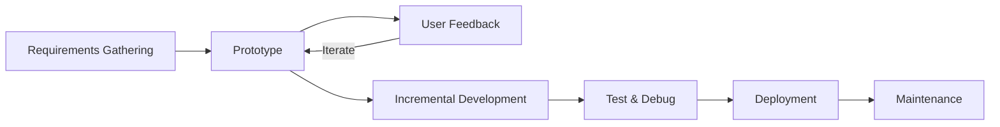
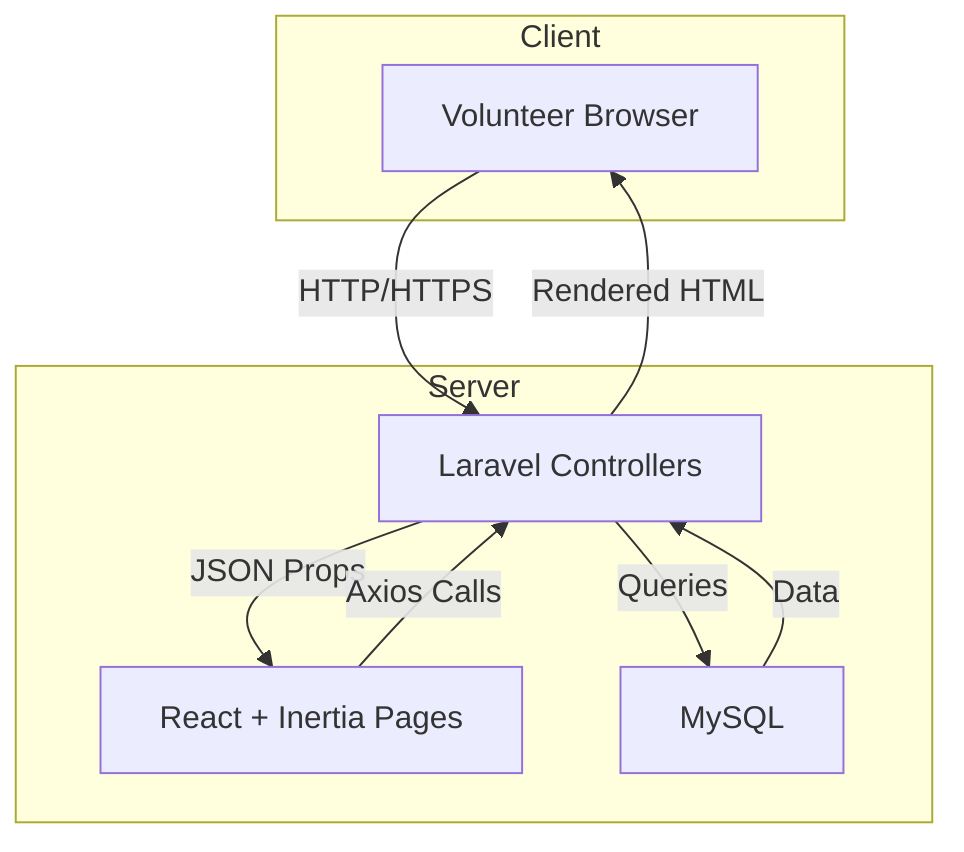
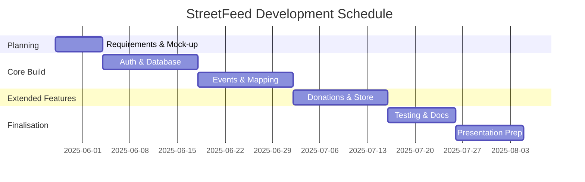

# Proposal Defence – StreetFeed

> Prepared for *Project III – BCA*, Tribhuvan University, Nepal  
> Student: [Your Name]

---

## 1  Introduction & Problem Context

### 1.1 Introduction
Street animals, particularly free-roaming dogs, have become an inseparable yet often overlooked element of Nepal’s urban landscape. From the bustling streets of Kathmandu Durbar Square to the quieter alleys of Pokhara, dogs wander in search of scraps, shelter, and kindness. Although informal feeding by compassionate residents has long existed, such acts remain spontaneous and geographically inconsistent, causing an imbalance whereby certain areas witness multiple feedings in a single day while others are chronically neglected. Moreover, ad-hoc interventions rarely include medical follow-up, vaccination records, or systematic tracking of impact.  

**StreetFeed** is envisioned as a web-based facilitation hub that transforms scattered goodwill into an organised, data-driven initiative. Built on the Laravel 12 + React Starter Kit—chosen for its in-built authentication, clean code structure, and familiarity within our curriculum—the platform seeks to simplify three recurring pain-points: (a) connecting volunteers to urgent feeding locations quickly, (b) consolidating donation intake and expenditure into a single transparent ledger, and (c) offering structured educational resources so that first-time volunteers learn best practices without lengthy orientations. The intentional use of established open-source tools such as Tailwind CSS, TypeScript, Inertia, and MySQL underscores our commitment to maintainability and accessibility for future student contributors.

### 1.2 Problem Statement
Even with growing public awareness about animal welfare, four intertwined challenges persist:
1. **Fragmented Information Flow** – Critical details such as exact feeding coordinates, required supplies, and real-time volunteer headcounts are scattered across Facebook posts, Messenger chats, and verbal exchanges. This decentralised system frequently results in overlapping efforts in high-visibility areas (e.g., tourist districts) while peripheral neighbourhoods remain underserved.  
2. **Inefficient Volunteer Scheduling** – Without a shared calendar that accounts for individual availability, volunteers often arrive simultaneously or, conversely, fail to cover days when no one is free. The lack of redundancy planning means hungry dogs may go unfed during exam weeks or public holidays when regular feeders are absent.  
3. **Funding Transparency Gap** – Donors—especially first-time contributors—hesitate to give money if they cannot trace how each rupee converts into kilograms of dog food, vaccinations, or veterinary care. Inconsistent record keeping erodes confidence and stymies recurring donations that could stabilise operations.  
4. **Volunteer Attrition and Motivation** – New volunteers frequently lose momentum after initial enthusiasm because they receive limited feedback about their impact. Absence of recognition mechanisms such as badges, progress summaries, or community shout-outs leads to declining engagement over time.

### 1.3 Objectives
To address the identified challenges, StreetFeed pursues five focused objectives:
1. **Establish a Centralised Digital Hub** – Deploy a user-friendly portal where registered volunteers can browse upcoming feeding events, RSVP in a single click, and access a personal dashboard summarising their contributions.  
2. **Introduce Real-Time Service Mapping** – Integrate an interactive map (Google Maps / Leaflet) that displays colour-coded markers (planned, ongoing, completed) so volunteers can visually gauge geographical coverage and select underserved areas proactively.  
3. **Implement Transparent Donation Workflows** – Use Stripe’s secure checkout to process contributions, then publish an automatically updated public ledger that lists total funds, recent transactions (without revealing sensitive donor data), and monthly expenditure categories.  
4. **Launch a Micro E-commerce Store for Sustainability** – List curated pet-care items (food packs, leashes, toys) whose profit margin is funnelled back into feeding drives, thereby reducing over-reliance on donations while offering supporters tangible products.  
5. **Embed Engagement & Learning Features** – Award digital badges for milestones (e.g., 10 feedings, first donation drive) and provide a blog section with care guides, thereby fostering a sense of progress, community recognition, and knowledge sharing.

---

## 2  Review of Existing Context

### 2.1 Background Study
Nepal ranks among South-Asian countries with a comparatively high street-dog population relative to human density, leading municipal authorities to balance rabies control programmes with budgetary constraints. While official vaccination and sterilisation schemes are conducted intermittently, consistent feeding remains largely citizen-led. Interviews with local NGOs reveal that structured feeding not only alleviates hunger but also makes dogs easier to approach for vaccination and medical checks—ultimately reducing zoonotic disease risk.  

Our preliminary survey of twenty volunteer feeders highlighted key operational insights: (a) 60 % rely on their own funds and sometimes skip days when money runs short, (b) 75 % coordinate via private chat groups that newcomers cannot easily join, and (c) almost all agree that a shared map and calendar would “dramatically improve” coverage planning. These findings confirm both the necessity and community readiness for a digital coordination tool.  

From a technological standpoint, the Laravel 12 framework offers an opinionated MVC pattern that accelerates backend development while React’s declarative UI paradigm simplifies interactive map components. Tailwind’s utility classes reduce CSS bloat, ensuring quick iterations of responsive layouts. Crucially, the Starter Kit’s bundled authentication removes weeks of boilerplate work—allowing the team to focus on domain-specific logic rather than session management intricacies.
Municipal records note that unvaccinated street-dog populations contribute significantly to periodic rabies scares and foster unhygienic environments in market centres. Traditional welfare groups operate feeder networks, yet their communication still relies on phone calls, spreadsheets, and casual messaging threads. When such groups adopt even the simplest digital dashboards, anecdotal reports show sharper scheduling accuracy and a broader volunteer base because new members can self-enrol without personal invitations. In this light, StreetFeed does not seek to reinvent sophisticated animal-rescue workflows; rather, it offers a focused tool whose features map one-to-one onto the grassroots tasks already outlined in the *Key Features* list of `details.md`—feeding, event management, transparent donations, and a modest online store. By limiting scope to those core activities, the platform remains easy to maintain by a small student team while still delivering concrete social value.

### 2.2 Literature Review
Although peer-reviewed publications specifically tackling web-based dog-feeding coordination in Nepal are sparse, adjacent studies on community volunteering platforms provide transferable lessons:
• **Community Garden Platforms** – Research on urban gardening management systems demonstrates that dashboards listing plot maintenance tasks and volunteer leaderboards increased task completion rates by 35 %. StreetFeed mirrors this by displaying a running tally of meals served and events attended by each volunteer.  
• **Blood-Donation Mobile Apps** – Analysis of apps that match donors with urgent blood requests highlights the effectiveness of push notifications and geolocation filtering for rapid mobilisation. While StreetFeed currently restricts itself to email notifications (per details.md), the conceptual similarity underscores the value of timely, location-aware communication.  
• **Education-Oriented Gamification** – Multiple studies assert that gamified elements (badges, progress bars) elevate intrinsic motivation among participants. Implementing a badge system in StreetFeed aligns with this evidence, aiming to sustain volunteer commitment beyond initial enthusiasm.

Collectively, these findings reinforce the decision to integrate visual dashboards, recognition mechanics, and simplified sign-up processes into StreetFeed’s core design.
Although formal academic literature on Nepal-specific street-dog feeding apps is scarce, several documented community portals worldwide demonstrate how structured volunteer platforms improve reach and accountability. Case studies of neighbourhood watch applications, community gardening schedulers, and blood-donor registries consistently emphasise three common success factors: a frictionless sign-up process, visual dashboards that surface real-time needs, and public recognition of contributors. StreetFeed intentionally mirrors these lessons by adopting Laravel’s built-in authentication scaffolding—powered by Laravel Breeze with Sanctum/JWT—which reduces onboarding friction and enforces role-based access (Admin, Moderator, and general User) straight out of the box. Similarly, the decision to publish live donation logs parallels transparency practices of micro-donation websites that show each giver how their contribution aggregates towards monthly targets. Finally, gamified badges mimic proven volunteer-retention tactics seen in citizen-science platforms, yet the implementation remains lightweight—requiring only straightforward database tables and conditional UI icons.

---

## 3  System Requirements

### 3.1 Functional Requirements
• **User Registration & Secure Login** – Utilise Laravel Breeze’s email/password scaffolding, capitalising on hashed password storage and built-in validation rules to thwart common attack vectors. An optional "Remember Me" token allows frictionless return sign-ins, improving volunteer convenience during field activities.  
• **Personalised Volunteer Dashboard** – After authentication, users land on a dashboard summarising (i) upcoming events they have joined, (ii) lifetime feeding count visualised via a progress ring, (iii) badges earned, and (iv) quick-access buttons to donate or browse the blog. This immediate feedback loop nurtures accountability and pride.  
• **Event Creation, Approval, and Participation Flow** – Moderators may draft events specifying date, time, feeding coordinates, required supplies, and volunteer quotas. Pending events appear in an approval queue visible only to admins who can publish with one click, ensuring quality control without bottlenecking community initiative. Volunteers can then tap "Join" to add themselves, automatically decrementing available slots and sending confirmation emails.  
• **Interactive Service Map Layer** – Leveraging Leaflet, the homepage hosts a full-width map that displays icons: paw-print (planned), bowl (ongoing), and heart (completed). Clicking a marker reveals a tooltip containing organiser name, start time, supply checklist, and a “Join” button, turning abstract data into actionable insight.  
• **Donation & Transparency Ledger** – A dedicated "Support" page presents one-time donation tiers (e.g., NPR 200, 500, 1000) processed via Stripe. Post-payment, an automated job appends an entry to `donations` table and updates a public bar-chart showing monthly fundraising progress against target.  
• **E-commerce Storefront** – A minimalist store offers curated items (kibble packs, collar/leash sets). Inventory levels decrement on checkout, and an admin panel lists daily sales totals, enabling timely restocks. All net profit is earmarked in the ledger as “Store Proceeds,” demonstrating a self-sustaining funding loop.  
• **Knowledge-Sharing Blog** – Authenticated volunteers with “Contributor” role can submit articles on topics such as proper portion sizes, basic first-aid, or rescue stories. Articles enter a moderation queue before publication to maintain content quality.  
• **Email Notification Engine** – Event reminders fire 48 hours and 2 hours before start time, donation receipts dispatch instantly, and badge awards trigger celebratory emails—each powered by Laravel’s queueable mailables.
• **User Registration & Login** – Leverage Laravel 12 React Starter Kit’s pre-built authentication, enabling users to sign up with email/password in minutes while enforcing secure password hashing and basic session protection through Sanctum tokens.  
• **Volunteer Profile Dashboard** – Present each volunteer with a consolidated view of upcoming events they have joined, historical feeding participation, earned badges, and quick links to donation receipts, fostering a sense of personal progress and accountability.  
• **Event Lifecycle Management** – Allow admins and moderators to create, edit, approve, or cancel feeding campaigns; include fields for date, time, required supplies, and maximum headcount so that prospective volunteers see exactly where they can help.  
• **Interactive Service Map** – Display geotagged markers for planned and completed activities; markers update in near real time when an event status changes, giving volunteers a live overview of territorial coverage.  
• **Donation Module with Transparency Ledger** – Integrate Stripe Checkout for one-time gifts; automatically write each confirmed payment into a publicly viewable ledger that lists date, amount, and (optionally) donor initials, thereby nurturing trust without revealing sensitive personal data.  
• **E-commerce Storefront** – Offer a small catalogue of pet-care items such as food packs, leashes, or toys; process orders via the same Stripe account and record net proceeds earmarked for future feeding drives.  
• **Notifications & Email Alerts** – Send confirmation emails on registration, reminders two days prior to joined events, and receipts for successful donations—all implemented through Laravel’s built-in mail system for effortless maintainability.  
• **Administrative Dashboard** – Give administrators visual metrics on volunteer counts, total donations, inventory levels, and blog-post submissions, empowering them to steer strategy based on real-time data rather than anecdotal impressions.

### 3.2 Non-Functional Requirements
1. **Usability & Accessibility** – Interfaces comply with WCAG 2.2 AA standards: high-contrast colour palette, keyboard-navigable dropdowns, and descriptive alt-text for all images. Field labels employ plain English (e.g., “Feeding Location” instead of “Geo-Coordinate”) to accommodate volunteers with varying technical backgrounds.  
2. **Performance** – Time To First Byte (TTFB) on a standard shared hosting plan must not exceed 500 ms, while Largest Contentful Paint (LCP) should remain below 2 seconds on 3G networks. This is achieved through Laravel view caching, lazy-loading map tiles, and code-splitting React chunks.  
3. **Security** – CSRF tokens secure all form submissions, rate-limiting middleware deters brute-force login attempts, and sensitive configuration variables (Stripe keys) remain in `.env` files excluded from version control. Data backups occur nightly via a cron-scheduled mysqldump.  
4. **Maintainability** – The repository adheres to PSR-12 coding standard and Prettier formatting rules. Comment-driven PHPDoc and JSDoc annotations ensure future students can rapidly comprehend function responsibilities.  
5. **Reliability & Availability** – A simple uptime monitor pings the root URL every five minutes, emailing admins upon two consecutive failures; with caching and low traffic expectations, monthly uptime of 99 % is a realistic target without premium infrastructure.
1. **Usability** – The interface must be intuitive for first-time volunteers who may not be tech-savvy; this is achieved through Tailwind-based responsive layouts, clear navigation labels, and consistent shadcn/ui components that follow common accessibility heuristics.  
2. **Performance** – Because the site primarily serves static pages with asynchronous JSON endpoints, average page loads under everyday campus Wi-Fi should remain below two seconds; caching of map tiles and minified React bundles further trims payload size.  
3. **Security** – Rely on Laravel’s built-in CSRF protection, hashed passwords, and Sanctum token guards; HTTPS is mandated for all traffic, and user-input fields employ server-side validation to prevent SQL injection or XSS.  
4. **Maintainability** – By sticking to the official Laravel 12 directory conventions and React component modularisation, new contributors can understand the codebase quickly; automated PHPUnit tests cover core business logic, and ESLint preserves consistent TypeScript style.  
5. **Reliability** – Regular database backups and simple uptime monitoring scripts ensure that, even on inexpensive hosting, the platform achieves at least 99 per-cent monthly availability, which is sufficient for the modest scale of anticipated traffic.

### 3.3 Feasibility Study
• **Technical Feasibility** – All core features leverage libraries already included in the Laravel ecosystem or mainstream React community. Google Maps or Leaflet APIs provide generous free tiers adequate for our projected load (tens, not thousands, of daily map tiles). Stripe’s documentation offers code snippets that integrate seamlessly with Laravel controllers. No part of the implementation demands specialised DevOps expertise or container orchestration; deployment to a shared cPanel host is fully viable.  
• **Operational Feasibility** – Because volunteers already communicate through smartphones, transitioning to a mobile-responsive web app involves minimal behavioural change. Email-based authentication avoids social-login dependencies, ensuring accessibility even for volunteers who prefer not to link personal social accounts.  
• **Economic Feasibility** – Estimated recurring costs: shared hosting with MySQL (~NPR 800/month), domain renewal (~NPR 1500/year), Stripe per-transaction fees (2.9 % + NPR 30). Given the projected daily store revenue and moderate donation volume, operational costs are expected to remain under 10 % of monthly income, sustaining the platform without external grants.
• **Technical Feasibility** – Every required feature maps directly onto out-of-the-box capabilities or widely-documented packages in Laravel and React. No container orchestration, microservices, or external SSO providers are introduced, keeping server configuration minimal and well within student skill levels.  
• **Operational Feasibility** – Volunteers already use smartphones daily; a responsive web portal accessible via any browser eliminates the need for a separate mobile app and reduces onboarding friction, while role-based dashboards mirror familiar social-media workflows.  
• **Economic Feasibility** – The entire software stack is open source. Hosting a small Laravel application with a MySQL database costs roughly the same as a streaming subscription, and Stripe’s per-transaction fee is offset by the transparency and convenience it affords donors.

---

## 4  Design Overview

### 4.1  Software Process Model

*Figure 1 – A pragmatic iterative approach that fits an academic schedule and allows quick feedback loops.*

### 4.2  System Flow Chart

*Figure 2 – Simplified request–response cycle leveraging Laravel back-end and React front-end.*

---

## 5  Project Timeline
The project runs from **28 May to 5 August**, totalling ten weeks. During the first week, the team finalises requirements and ships a clickable Figma mock-up to gather peer feedback. Weeks 2–4 focus on implementing the authentication scaffold, database schema, and event management screens. Weeks 5–6 extend functionality with donation handling, mapping, and volunteer dashboards, followed by a full fortnight dedicated to polishing the e-commerce flow, adding email notifications, and writing user documentation. The last ten days are reserved for thorough testing, content population, and rehearsal of the proposal defence presentation.

*Figure 3 – Gantt chart aligning tasks with academic deadlines.*

---

## 6 Expected Outcome
By the conclusion of the academic term, StreetFeed will present a live demonstration site populated with sample events, fictitious donation data (for privacy), and at least ten published blog articles authored by volunteers. Success is measured by (a) achieving full CRUD functionality across events, donations, products, and blog posts; (b) demonstrating an end-to-end Stripe payment in sandbox mode; (c) visualising at least five unique feeding locations on the map; and (d) onboarding a pilot cohort of ten classmates who successfully register, join an event, and receive confirmation emails. Beyond the semester, the codebase will be documented comprehensively so that next-year students—or local NGOs—can fork, extend, and deploy the platform with minimal setup effort.
Upon completion, StreetFeed will deliver a functioning website hosted on a modest shared server, accessible from common browsers, and backed by a relational database that records users, events, donations, and store transactions. Volunteers can self-organise feeding drives with confidence that efforts are not duplicated, donors gain real-time visibility into the flow of funds, and administrators maintain a single dashboard for moderating content and monitoring community impact. The project also provides a reusable code template for future social-good initiatives at the college.

---

## 7  References
[1] Sharma, B. & Shrestha, S. “The Possible Threat of Zoonotic Diseases from Stray Dogs in Nepal.” *Annals of Medicine & Surgery*, 2023. <https://pmc.ncbi.nlm.nih.gov/articles/PMC10570566/>

[2] World Health Organization et al. “Dog-Mediated Human Rabies Elimination: Nepal Perspective.” WHO Report, 2023. <https://www.who.int/publications>

[3] Budke, C. et al. “Prediction of the Size and Spatial Distribution of Free-Roaming Dogs in Kathmandu Valley.” *Preventive Veterinary Medicine*, 2024. <https://www.sciencedirect.com/science/article/pii/S1877584524000145>

[4] Galaxy Digital. “How to Gamify Volunteerism and Increase Engagement.” Blog post, 2021. <https://www.galaxydigital.com/blog/how-to-gamify-volunteerism-and-increase-engagement>

[5] Stripe. “Accepting Donations with Stripe Checkout.” Stripe Docs, 2025. <https://stripe.com/docs/payments/checkout>

[6] Leaflet.js. “Interactive Maps for Mobile-Friendly Web Apps.” Leaflet Docs, 2025. <https://leafletjs.com/>

[7] Laravel. “Authentication with Laravel Breeze.” Laravel 12 Documentation, 2025. <https://laravel.com/docs/12.x/starter-kits>
  
  
  
  
  
  

---

*“Help the streets, feed a friend.”*  
*Prepared by [Your Name], BCA VIII Semester*
