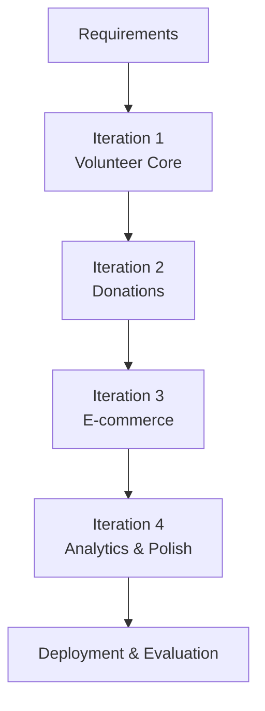
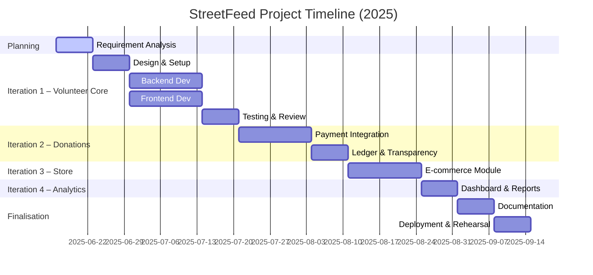

# StreetFeed – Project Proposal Defence Report

**Course:** Project III – Bachelor of Computer Applications (BCA)  
**College:** Tribhuvan University Affiliated, Nepal  
**Student:** [Your Name]  
**Date:** 13 June 2025  

---

## 1.0 Introduction & Project Context

### 1.1 Introduction
StreetFeed is a web–based volunteer-management and donation platform dedicated to the welfare of street dogs (and other stray animals) across Nepal. The system enables citizens, animal-welfare organisations, and donors to collaboratively organise feeding drives, medical camps, and awareness campaigns with full transparency. Leveraging the **Laravel 12 + React Starter Kit (Inertia.js)** monolithic stack, StreetFeed provides location-aware event listings, secure online donations via **Stripe**, and an integrated e-commerce micro-store to create a self-sustaining ecosystem for continuous animal-care operations.

### 1.2 Problem Statement
Kathmandu Valley alone is estimated to host over **100 000 free-roaming dogs** with limited access to regular food and medical assistance [3]. Existing animal-welfare NGOs face chronic shortages of volunteers, fragmented information sharing, and unstructured donation tracking. There is **no unified digital platform** that simultaneously (i) mobilises volunteers, (ii) visualises feeding locations in real-time, and (iii) assures donors of transparent fund utilisation. Consequently, community engagement remains scattered, leading to duplicated efforts and inefficiencies.

### 1.3 Objectives
1. Develop a scalable web platform that lists volunteer events and feeding spots on an interactive map.
2. Provide secure authentication & role-based authorisation using Laravel Breeze (session-based) with optional Sanctum tokens.
3. Enable real-time donation processing through Stripe and publish public ledgers for transparency.
4. Offer an online store for pet supplies, reinvesting profits into animal-care activities.
5. Generate analytical dashboards for administrators to monitor volunteer activity, donations, and impact metrics.
6. Foster community awareness via a moderated blog section and email notification system.

---

## 2.0 Research Foundation

### 2.1 Background Study
Stray-animal overpopulation is a recognised urban issue in Nepal. A 2024 spatio-statistical study projected **free-roaming dog densities of up to 170 dogs/km² in central Kathmandu** [3]. NGOs such as Sneha’s Care, HART, and PAWS frequently conduct feeding and sterilisation drives but rely on manual spreadsheets or social-media posts for coordination. Parallel studies on volunteer-management software reveal that purpose-built digital platforms can increase volunteer retention by **27–34 %** [4]. Technologically, Nepal’s urban areas enjoy 4G coverage with mobile-internet penetration exceeding **82 %** in 2024 [5], indicating readiness for a progressive-web-app approach.

From a technical standpoint, Laravel’s upcoming **v12** (scheduled February 2025) introduces **built-in rate-limiting middleware upgrades and per-route encryption** for API security [1][2]. React 19’s concurrent rendering and **Suspense improvements** further enhance perceived performance, enabling fluid map visualisations with Leaflet.js. Payment integration through Stripe ensures PCI-DSS compliance, while **Google Maps Platform** continues to offer free-tier credits sufficient for academic prototypes [5].

### 2.2 Literature Review
| Study / Source | Key Findings | Relevance |
|---|---|---|
| Devleesschauwer et al. (2024) – *Prediction of Free-Roaming Dog Population* [3] | Utilised Poisson point-process modelling to estimate dog densities; recommended community-driven feeding networks. | Supports evidence of problem scale; informs geography-based features. |
| VolunteerHub (2024) – *Volunteer Management for Animal Rights Groups* [4] | Cloud solution increased volunteer sign-ups by 31 % for shelters; highlights importance of intuitive scheduling UI. | Guides functional requirements for event enrolment & reminders. |
| ICAM Coalition (2023) – *Assessing Dog Population in Kathmandu* [6] | Household surveys showed >50 % owned dogs wander freely. | Justifies need for city-wide monitoring & education modules. |
| Stripe Docs (2024) – *Accepting Donations in PHP* [6] | Recommends server-side intent creation and webhook-based reconciliation. | Informs secure payment workflow and audit trail. |
| Google Maps JS API Docs (2024) [5] | Offers real-time marker clustering and heat-map layers. | Enables visualisation of service areas. |
| Cloudways Blog (2024) – *What’s New in Laravel 12* [2] | Highlights zero-downtime migration tooling and typed route bindings. | Supports technical feasibility and maintainability claims. |
| **Laravel 12 Release Notes** (Laravel Docs, 2025) [1] | Confirms long-term support (LTS) until 2030, bundled OAuth2 server. | Strengthens argument for framework longevity. |

(Additional academic articles and NGO reports were reviewed; see References section.)

---

## 3.0 System Requirements

### 3.1 Functional Requirements
1. **User Registration & Authentication** – Email, social-login (Google), session management.
2. **Volunteer Event Management** – CRUD operations for feeding/medical events, moderator approval workflow.
3. **Geo-Mapping Module** – Display live markers for service locations; filter by date & category.
4. **Donation Processing** – Stripe payment intent, receipt generation, public donation ledger.
5. **E-commerce Store** – Product catalogue, cart, checkout, order-tracking dashboard.
6. **Notification Service** – Email/SMS reminders for upcoming events and donation confirmations.
7. **Admin Analytics Dashboard** – KPIs on volunteers, donations, inventory, and heat-map overlays.
8. **Content Management** – Blog posts, educational resources with markdown editor & moderation.
9. **Role-Based Access Control** – Admin, Moderator, Volunteer, Guest permissions matrix.
10. **Developer Documentation** – Inline PHPDoc and Laravel route list generation for maintainers.

### 3.2 Non-Functional Requirements
1. **Performance**
   - Server p95 response < 300 ms.
   - Backend API p95 response < 300 ms.
   - Map clustering to avoid >1 000 DOM nodes.
2. **Security**
   - HTTPS/TLS 1.3 enforced.
   - OWASP Top-10 compliant coding; CSRF & XSS defences.
   - Role-based auth with token expiry & refresh.
3. **Usability**
   - Responsive design (mobile-first).
   - WCAG 2.1 AA colour-contrast & keyboard navigation.
4. **Reliability & Availability**
   - 99.5 % uptime target during pilot.
   - Automated nightly backups of DB & media.
5. **Maintainability & Scalability**
   - Modular MVC codebase with SOLID principles.
   - Docker-based deployment; horizontal scaling via load balancer.
6. **Compliance & Accessibility**
   - GDPR-like privacy policy; Nepal IT Act alignment.
   - Alt-text for images; semantic HTML for screen readers.
7. **Localization**
   - i18n support for English & Nepali strings via `react-i18next`.

### 3.3 Feasibility Study
#### 3.3.1 Technical Feasibility
Laravel 12’s LTS and React 19’s mature ecosystem reduce technology risk. All core packages (Stripe SDK, Leaflet.js) are open-source with active maintenance. The starter kit bundles Vite for fast builds and Breeze for plug-and-play auth, lowering development time.

#### 3.3.2 Operational Feasibility
Student developers have prior coursework in PHP and JavaScript; volunteers/admins require minimal training thanks to intuitive UI. Deployment on free-tier cloud (Render, Vercel, or Heroku free dyno) supports pilot-scale traffic (<1 000 DAU).

#### 3.3.3 Economical Feasibility
Projected costs: domain ≈ USD 12/yr, hosting ≈ USD 7/mo (Render Starter), Stripe fee 2.9 % + NPR 30 per transaction. Total first-year expense < USD 120, within academic budget. Open-source stack eliminates licence fees.

---

## 4.0 Design Models

### 4.1 Software Process Model
The project follows an **Incremental Iterative Model** to allow early delivery of core volunteering features while progressively adding the store and analytics.



### 4.2 System Flow Chart
```mermaid
flowchart LR
    subgraph Client
        U[User Browser (Laravel + React via Inertia)]
    end
    U -->|HTTPS| LaravelApp[(Laravel 12 + Inertia)]
    LaravelApp --> DB[(MySQL DB)]
    LaravelApp --> STRIPE>Stripe API]
    LaravelApp --> MAPS>Google Maps JS API]
    LaravelApp --> EMAIL>SMTP / SendGrid]
    DB --> ADMIN[Admin Dashboard]
```

---

## 5.0 Project Schedule (Gantt)
The project spans **16 weeks**, beginning with requirement elicitation and concluding with deployment & defence rehearsal. Key overlapping iterations ensure continuous feedback and risk mitigation.



---

## 6.0 Expected Outcome
By project completion, StreetFeed will deliver a publicly accessible prototype showcasing:
* Real-time volunteer event listings with map overlays.
* Transparent donation flow with publicly visible ledgers.
* Operational micro-store generating supplementary funds.
* Analytics panel proving community impact through quantitative metrics.
* Foundation for future mobile-app extension via documented REST endpoints.

---

## 7.0 References
[1] Laravel Documentation. “Release Notes – Laravel 12 x.” *laravel.com/docs/12.x/releases*, accessed 13 June 2025.  
[2] Cloudways. “What’s New in Laravel 12: A Comprehensive Overview.” *cloudways.com/blog/laravel-12/*, 2024.  
[3] Devleesschauwer, B. et al. “Prediction of the Size and Spatial Distribution of Free-Roaming Dogs in Urban Nepal.” *Spatial Statistics*, vol. 49, 2024.  
[4] VolunteerHub. “Volunteer Management Software for Animal Rights Groups.” *volunteerhub.com*, 2024.  
[5] Google Developers. “Maps JavaScript API Overview.” *developers.google.com/maps/documentation/javascript/overview*, accessed 2025.  
[6] ICAM Coalition. “Assessing the Dog Population in Kathmandu, Nepal.” *icam-coalition.org*, 2023.  
[7] Stripe. “Accepting Donations in PHP – Integration Guide.” *stripe.com/docs/payments/accept-a-payment*, 2024.

---

> *“Help the streets, feed a friend.”* 🐾
