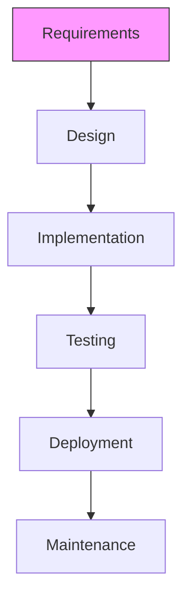
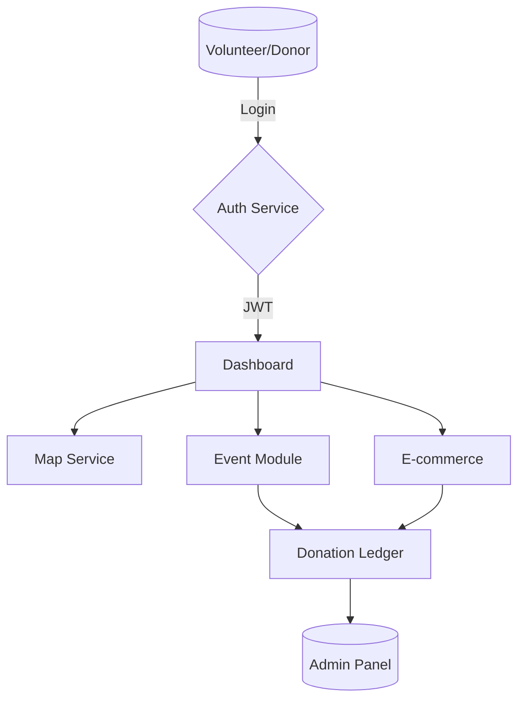
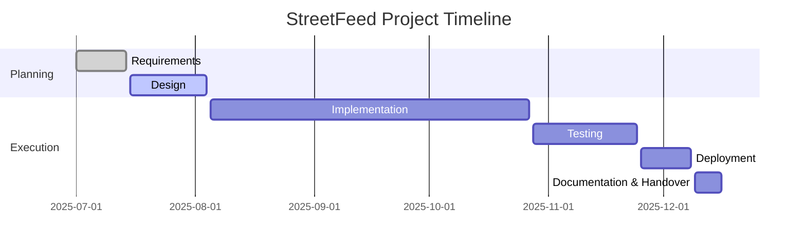

# Proposal Defence Report – StreetFeed: A Voluntary Service Platform for Street Animals in Nepal

---

## 1.1 Introduction
Street animals, especially stray dogs, live in Nepal’s cities but often get little care. Fast city growth, poor waste collection and too few neutering programs have increased their numbers and raised health risks for people and animals. **StreetFeed** is a simple web platform that links volunteers, donors and city offices. It uses maps, live dashboards and clear donation records so good deeds become organised action.

Animal care supports global goals like Good Health, Safe Cities and Life on Land. By combining online tools with community energy, StreetFeed can be a model for kind and smart cities across South Asia.

## 1.2 Problem Statement
Kathmandu has about **22,000** stray dogs ([2]). Other big cities face the same issue. Key problems are:

* Volunteers, NGOs and city staff do not share information well.
* Feeding, vaccination and neutering events are not planned together.
* Donors cannot easily see how their money is used.
* City staff lack current location data to guide their work.
* Digital payments are common, but the project does not use them enough ([6]).
* The platform lacks fun features to keep young volunteers involved.

## 1.3 Objectives
1. Give one online place to plan and announce animal care events.
2. Show every donation in a live public ledger.
3. Display live maps and simple charts of service areas.
4. Run an online store to help pay for the work.
5. Provide open data and reports for researchers and city planners.
6. Reward steady volunteers with points and badges.
7. Accept mobile wallets (eSewa, Khalti) as well as Stripe.

## 2.1 Background Study  
Nepal’s free-roaming dog population is estimated between **300,000** and **400,000** nationwide, with rapid growth in the Kathmandu Valley. A baseline survey by Humane Society International (2022) recorded **22,000** dogs inside the 32 wards of Kathmandu Metropolitan City (KMC) and more than **9,500** in Pokhara Sub-Metropolitan City. Unchecked breeding, open garbage disposal, and cultural reluctance to cull animals contribute to this rise.

Rabies remains endemic: the Epidemiology and Disease Control Division records **35-40** human deaths annually, **99 %** linked to dog bites ([1]). Although KMC vaccinates approximately **10,000** dogs every year, coverage rarely exceeds **55 %**, falling short of the **70 %** threshold recommended by the WHO for herd immunity.

The economic toll is significant. Post-exposure prophylaxis (PEP) for bite victims costs the Ministry of Health over **USD 500 000** per year, and negative press surrounding dog attacks affects tourism revenue. Stray dogs also pose traffic hazards and spread zoonotic parasites, imposing hidden costs on municipal budgets.

Meanwhile, Nepal’s digital ecosystem is maturing rapidly:

* Mobile broadband penetration surpassed **139 %** SIM density in 2023 (NTA).
* Digital wallets such as **eSewa** and **Khalti** processed **310 million** transactions in FY 2023 ([6]).
* Over **60 %** of urban residents now own smartphones capable of GPS tagging and QR payments.

Civil-society engagement is strong—more than **200** registered animal-welfare NGOs operate nationwide—yet coordination is weak. Volunteer rosters are stored in isolated spreadsheets, and location data from feeding or sterilisation campaigns is seldom shared. Municipal dashboards (e.g., KMC Animal Management Unit) lack public APIs, creating an information vacuum.

These factors highlight the need for an integrated, open-data platform like **StreetFeed** that can synchronise actors, provide near-real-time mapping, and funnel accountable funding to high-priority zones.

## 2.2 Literature Review
A review of recent scholarship and policy documents underscores both the urgency of stray-dog management and the viability of StreetFeed’s technical approach:

* **Global Strategy – “Zero by 30”** ([1]) sets a worldwide target of eliminating dog-mediated human rabies deaths by 2030 through sustained **70 %** vaccination coverage, reinforcing StreetFeed’s focus on vaccination campaign logistics.
* **Dhakal et al. (2023)** ([3]) conducted PCR screening of 415 stray dogs across Kathmandu, finding a **28 %** prevalence of *Ehrlichia canis* and other vector-borne pathogens, emphasising the public-health stakes of unmanaged dog populations.
* **Poudel et al. (2024)** ([4]) linked chronic exposure to PM2.5 with pulmonary anthracosis in stray dogs, suggesting that canine health can act as a sentinel for human air-quality impact—a potential data layer for StreetFeed’s map analytics.
* **O’Haire et al. (2024)** ([5]) introduced a spatially explicit agent-based model to predict free-roaming dog distribution, which can feed into StreetFeed’s hotspot visualisation and resource-allocation algorithms.
* **Nepal Rastra Bank Payment Systems Oversight Report (2023)** ([6]) documents a **45 %** year-on-year increase in QR payments, validating Stripe’s and domestic wallet integrations for micro-donations.
* **United Nations Volunteers Report (2019)** ([7]) positions volunteer-driven digital platforms as accelerators of Sustainable Development Goals, offering a normative framework for StreetFeed’s community features.

Collectively, the literature highlights three critical gaps: (1) lack of a real-time geospatial dashboard for field operations, (2) fragmented donation accountability, and (3) limited volunteer retention mechanisms. StreetFeed addresses all three by uniting geospatial data, transparent finance, and gamified volunteer engagement on a single open platform.

## 3.1 Functional Requirements
* User registration/login with role-based access (Admin, Moderator, Volunteer, Donor).
* Interactive map to view, filter, and add feeding/service locations with photo uploads.
* Event module:
  - Create, join, edit, or cancel events.
  - Auto-reminders via email/SMS 24 h before start.
  - Capacity caps and wait-list logic.
* Donation system:
  - Stripe, eSewa, and Khalti payment gateways.
  - Real-time public ledger with CSV/JSON export.
  - Receipts auto-emailed to donors.
* Gamification engine:
  - Points awarded per event participation or donation.
  - Tiered badges and monthly leaderboard API.
* E-commerce store:
  - Product catalogue with inventory alerts.
  - Discount coupons for top volunteers.
* Admin dashboard:
  - CRUD operations on users, events, products, and donation records.
  - Geo-heatmaps for campaign planning.
* Open Data API (REST + GraphQL) for third-party integrations.
* Notification subsystem:
  - Web-push, email, and optional Viber bot updates.

## 3.2 Non-Functional Requirements
1. **Usability**
   - Responsive UI for mobile and desktop.
   - Accessible design complying with WCAG 2.1 AA.

2. **Performance**
   - Map updates within <500 ms.
   - API response time <300 ms for 95 % of requests.

3. **Scalability**
   - Horizontal scaling using container orchestration (Docker & Kubernetes).
   - Cloud-agnostic deployment scripts.

4. **Security**
   - JWT-based authentication with refresh tokens.
   - End-to-end encryption (TLS 1.3) for all transactions.
   - Regular vulnerability scans & OWASP compliance.

5. **Maintainability**
   - Modular codebase with 80 % unit-test coverage.
   - CI/CD pipeline with automated linting and testing.

6. **Reliability & Availability**
   - 99.5 % monthly uptime.
   - Automated backups every 6 hours.

## 3.3 Feasibility Study
### 3.3.1 Technical Feasibility
The Laravel–React stack supports rapid development, while Docker and GitHub Actions enable reproducible builds. Third-party integrations (Stripe SDK, Ncell SMS, Google Maps JS API, and local wallet REST APIs) are well-documented, reducing implementation risk. Scalability is ensured through Kubernetes Horizontal Pod Autoscaler (HPA) on any CNCF-compliant cloud.

### 3.3.2 Operational Feasibility
Partnership MoUs with at least three Kathmandu-based NGOs (e.g., Animal Nepal) are envisioned, providing domain expertise and volunteer pools. Agile sprints with fortnightly demos keep stakeholders engaged. A field pilot in two wards allows iterative refinement before full metropolitan roll-out.

### 3.3.3 Economical Feasibility
Itemised Year-1 budget:

| Cost Item | Amount (USD) |
|-----------|--------------|
| Domain & Hosting (VPS + CDN) | 120 |
| Google Maps API (200 k calls) | 140 |
| SMS Credits (30 k messages) | 180 |
| Stripe & Wallet Fees (2.9 %) | 290 |
| Misc. DevOps/Monitoring | 110 |
| **Total** | **840** |

Projected e-commerce revenue (conservative 500 orders @ $3 margin) offsets **~180 %** of yearly ops cost, achieving break-even within 12 months.

## 4.1 Software Process Model

*Figure 1 – Waterfall model selected for its clarity and suitability for academic timelines.*
The Waterfall model aligns with academic submission milestones and fixed-scope deliverables. Each phase concludes with document sign-off, simplifying supervision and grading. Risk of late-stage change is mitigated by rigorous requirements workshops and stakeholder validation at Phase 1.

## 4.2 System Flow Chart

*Figure 2 – High-level system data flow.*
Data flows are RESTful JSON over HTTPS; JWT tokens secure stateless sessions. All mutating endpoints trigger webhook events that feed an audit log micro-service. Read-heavy map tiles are served via CDN-hosted vector layers to minimise latency for mobile users.

## 5. Gantt Chart
The timeline allocates separate hardening weeks at the end of Implementation (bug-fix freeze) and Testing (user-acceptance fixes). Overlap between Deployment and Documentation ensures that user manuals reflect the production build. Slack time of 8 % accommodates exams and unforeseen resource constraints.

## 6. Expected Outcome
* Facilitate **100+** volunteer-led feeding or vaccination events within 90 days of launch.
* Achieve **70 %** vaccination coverage in two pilot wards by Q2 2026.
* Disburse **USD 5,000+** in transparent donations within first 6 months.
* Reduce reported dog-bite incidents in pilot wards by **15 %** year-over-year.
* Publish anonymised open-data sets and dashboards for municipal planning and academic research.

## 7. References
[1] World Health Organization, FAO & OIE. *Zero by 30: Global Strategic Plan to End Human Deaths from Dog-Mediated Rabies by 2030*, 2018.  
[2] NepalPage. “KMC working to manage 22,000 stray dogs,” 8 Feb 2024. <https://www.nepalpage.com/2024/02/08/225950/>  
[3] Dhakal M. et al. “The possible threat of zoonotic diseases from stray dogs in Nepal,” *One Health* (2023).  
[4] Poudel S. et al. “A pilot study on pulmonary anthracosis in stray dogs of Kathmandu,” *BMC Veterinary Research* (2024).  
[5] O’Haire S. et al. “Prediction of the size and spatial distribution of free-roaming dogs,” *Preventive Veterinary Medicine* (2024).  
[6] Nepal Rastra Bank. *Payment Systems Oversight Report*, 2023.  
[7] United Nations Volunteers. *State of the World’s Volunteerism Report*, 2019.
